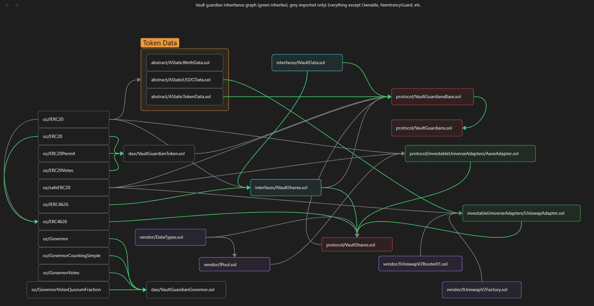

\begin{titlepage}
    \centering
    \begin{figure}[h]
        \centering
        \includegraphics[width=0.5\textwidth]{logo.pdf} 
    \end{figure}
    \vspace*{2cm}
    {\Huge\bfseries Protocol Audit Report\par}
    \vspace{1cm}
    {\Large Version 1.0\par}
    \vspace{2cm}
    {\Large\itshape Cyfrin.io\par}
    \vfill
    {\large \today\par}
\end{titlepage}

\maketitle

<!-- Your report starts here! -->

Prepared by: [Cyfrin](https://cyfrin.io)
Lead Auditors: 
- ALtera21

# Table of Contents
- [Table of Contents](#table-of-contents)
- [Disclaimer](#disclaimer)
- [Risk Classification](#risk-classification)
- [Audit Details](#audit-details)
  - [Scope](#scope)
- [Protocol Summary](#protocol-summary)
  - [Roles](#roles)
  - [Issues Found](#issues-found)
- [High](#high)
    - [\[H-1\] `VaultGuardianToken` received by guardian can be minted everytime someone becomes a guardian with no cost](#h-1-vaultguardiantoken-received-by-guardian-can-be-minted-everytime-someone-becomes-a-guardian-with-no-cost)
    - [\[H-2\] Miscalculation in `UniswapAdapter::_uniswapInvest` causes allocation data to be wrong](#h-2-miscalculation-in-uniswapadapter_uniswapinvest-causes-allocation-data-to-be-wrong)
    - [\[H-3\] Ignoring slippage protection `UniswapAdapter::_uniswapInvest` function](#h-3-ignoring-slippage-protection-uniswapadapter_uniswapinvest-function)
- [Medium](#medium)
    - [\[M-1\] `VaultShares::updateHoldingAllocation` did not update the holding allocations automatically](#m-1-vaultsharesupdateholdingallocation-did-not-update-the-holding-allocations-automatically)
- [Questions](#questions)
- [Inheritance graph](#inheritance-graph)

# Disclaimer

The ALtera21 team makes all effort to find as many vulnerabilities in the code in the given time period, but holds no responsibilities for the findings provided in this document. A security audit by the team is not an endorsement of the underlying business or product. The audit was time-boxed and the review of the code was solely on the security aspects of the Solidity implementation of the contracts.

# Risk Classification

|            |        | Impact |        |     |
| ---------- | ------ | ------ | ------ | --- |
|            |        | High   | Medium | Low |
|            | High   | H      | H/M    | M   |
| Likelihood | Medium | H/M    | M      | M/L |
|            | Low    | M      | M/L    | L   |

We use the [CodeHawks](https://docs.codehawks.com/hawks-auditors/how-to-evaluate-a-finding-severity) severity matrix to determine severity. See the documentation for more details.

# Audit Details 

**The findings described in this document correspond the following commit hash:**
```
daa885d5cb05b4fe1c48f9708ac1c096b372f3c0
```

## Scope 

```
./src/
#-- abstract
|   #-- AStaticTokenData.sol
|   #-- AStaticUSDCData.sol
|   #-- AStaticWethData.sol
#-- dao
|   #-- VaultGuardianGovernor.sol
|   #-- VaultGuardianToken.sol
#-- interfaces
|   #-- IVaultData.sol
|   #-- IVaultGuardians.sol
|   #-- IVaultShares.sol
|   #-- InvestableUniverseAdapter.sol
#-- protocol
|   #-- VaultGuardians.sol
|   #-- VaultGuardiansBase.sol
|   #-- VaultShares.sol
|   #-- investableUniverseAdapters
|       #-- AaveAdapter.sol
|       #-- UniswapAdapter.sol
#-- vendor
    #-- DataTypes.sol
    #-- IPool.sol
    #-- IUniswapV2Factory.sol
    #-- IUniswapV2Router01.sol
```

# Protocol Summary 

This protocol allows users to deposit certain ERC20s into an [ERC4626 vault](https://eips.ethereum.org/EIPS/eip-4626) managed by a human being, or a `vaultGuardian`. The goal of a `vaultGuardian` is to manage the vault in a way that maximizes the value of the vault for the users who have despoited money into the vault.

## Roles

There are 4 main roles associated with the system. 

- *Vault Guardian DAO*: The org that takes a cut of all profits, controlled by the `VaultGuardianToken`. The DAO that controls a few variables of the protocol, including:
  - `s_guardianStakePrice`
  - `s_guardianAndDaoCut`
  - And takes a cut of the ERC20s made from the protocol
- *DAO Participants*: Holders of the `VaultGuardianToken` who vote and take profits on the protocol
- *Vault Guardians*: Strategists/hedge fund managers who have the ability to move assets in and out of the investable universe. They take a cut of revenue from the protocol. 
- *Investors*: The users of the protocol. They deposit assets to gain yield from the investments of the Vault Guardians. 

## Issues Found

| Severity | Number of issues found |
| -------- | ---------------------- |
| High     | 3                      |
| Medium   | 1                      |
| Low      | 0                      |
| Info     | 0                      |
| Gas      | 0                      |
| Total    | 6                      |

# High

### [H-1] `VaultGuardianToken` received by guardian can be minted everytime someone becomes a guardian with no cost

**Description:** The `VaultGuardianToken` was meant to be minted by the guardian through `VaultGuardiansBase::becomeGuardian` function.
This function then calls a private `VaultGuardiansBase::_becomeTokenGuardian` function which mints `VaultGuardianToken` to the guardian

```javascript
    function _becomeTokenGuardian(IERC20 token, VaultShares tokenVault) private returns (address) {
        s_guardians[msg.sender][token] = IVaultShares(address(tokenVault));
        emit GuardianAdded(msg.sender, token);
@>      i_vgToken.mint(msg.sender, s_guardianStakePrice);
        token.safeTransferFrom(msg.sender, address(this), s_guardianStakePrice);
        bool succ = token.approve(address(tokenVault), s_guardianStakePrice);
        if (!succ) {
            revert VaultGuardiansBase__TransferFailed();
        }
        uint256 shares = tokenVault.deposit(s_guardianStakePrice, msg.sender);
        if (shares == 0) {
            revert VaultGuardiansBase__TransferFailed();
        }
        return address(tokenVault);
    }
```

accroding to the docs provided, the `VaultGuardianToken` purpose is to cast votes on proposals to:
- Updating pricing parameters
- Getting a cut of all performance of all guardians

But, there is no way for the guardian to `burn` or dispose of the `VaultGuardianToken` even after quitting the guardian role

**Impact:** As a result, the ex-guardian still have a power to vote on the DAO without any cost. anyone can become a guardian and quit multiple times to get more and more `VaultGuardianToken`.

**Proof of Concept:** Consider the following scenario:

1. A malicious user had enough money to become a guardin (whether through flashloans or their own wealth)
2. They become a guardian by paying the amount of `VaultGuardiansBase::s_guardianStakePrice`
3. Protocol mint `VaultGuardianToken` the same amount as `VaultGuardiansBase::s_guardianStakePrice`
4. After receiveing the token, the malicious user quit becoming a guardian by calling `VaultGuardiansBase::quitGuardian`
5. Repeat step 2

<details>
<summary>Proof of Code</summary>

add the following test function into `test/unit/concrete/VaultGuardiansBaseTest.t.sol` test suite

```javascript
    function testGuardianCanMintInfiniteAmountOfVaultGuardianTokens() public {
        // 1. The malicious user have enough money
        address badUser = makeAddr("malicious user");
        uint256 badUsersCurrentWETH = 10 ether;
        weth.mint(badUsersCurrentWETH, badUser);
        allocationData = AllocationData(1000, 0, 0); // we allocate the data to all hold
        
        // 2. The malicious user become a guardian
        // 2.1 we made sure we know the current balance before and after becoming guardian 
        uint256 wethBalanceBefore = weth.balanceOf(address(badUser));
        
        vm.startPrank(badUser);
        // 2.2 the alicious user approve the the trasfer of weth to vaultGuardians
        weth.approve(address(vaultGuardians), badUsersCurrentWETH);

        // 2.3 malicous users becoming guardian and receive VaultGuardianTokens
        address wethVault = vaultGuardians.becomeGuardian(allocationData);
        VaultShares vaultSharesWeth = VaultShares(wethVault);

        // 3. Bad users then quit the guardian role
        // 3.1 we must approve the VaultGuardian contract to receieve our shares
        vaultSharesWeth.approve(address(vaultGuardians), type(uint256).max);
        // 3.2 malicious users quit becoming guardian
        vaultGuardians.quitGuardian();
        vm.stopPrank();

        uint256 wethBalanceAfter = weth.balanceOf(address(badUser));
        uint256 vaultGuardianTokenBalance = vaultGuardianToken.balanceOf(badUser);
        
        // 4. Made sure the balance of weth is the same before and after
        assertApproxEqAbs(wethBalanceAfter, wethBalanceBefore, 1e16);
        assertApproxEqAbs(wethBalanceAfter, vaultGuardianTokenBalance, 1e16);

        // 5. we redo the second step over-and over again
    }
```
</details>

**Recommended Mitigation:** The simplest method is to burn the `VaultGuardianToken` when a guardian wants to quit. But remember to burn the exact amount the guardian minted when becoming a guardian, not burning the same value as `VaultGuardiansBase::s_guardianStakePrice`, since the value can be changed less then the correct amount

### [H-2] Miscalculation in `UniswapAdapter::_uniswapInvest` causes allocation data to be wrong

**Description:** According to the docs written for `UniswapAdapter::_uniswapInvest` function. its intend is to swap half the allocation value to receive the counter token pairs, and the other half to invest into Uniswap's liquidity pool to obatain liquidity tokens.

But after swapping was succesful, they added the full amount of allocation value and the swapped counter token pairs as liquidity to Uniswap

```javascript
    function _uniswapInvest(IERC20 token, uint256 amount) internal {
        .
        .
        .
@>      uint256 amountOfTokenToSwap = amount / 2;
        .
        .
        .
        uint256[] memory amounts = i_uniswapRouter.swapExactTokensForTokens({
            amountIn: amountOfTokenToSwap,
            .
            .
            .        .
        .
        .
@>       succ = token.approve(address(i_uniswapRouter), amountOfTokenToSwap + amounts[0]);
        .
        .
        .

        (uint256 tokenAmount, uint256 counterPartyTokenAmount, uint256 liquidity) = i_uniswapRouter.addLiquidity({
            .
            .
            .
@>           amountADesired: amountOfTokenToSwap + amounts[0],
            .
            .
            .
    }
```

**Impact:** Because of this, the actual amount allocated to be invested in Uniswap was 1.5 times bigger than the intended amount

**Proof of Concept:**

1. supposed the Allocation data is 200, 400, 400 (meaning 20% hold, 40% Uniswap, 40% AAVE)
2. someone becomes a guardian and automatically deposit the money to the created vault. (for simplicity, assuming the first deposited amount was 10 ether, same as contract)
3. 40% of 10 ether is 4 ether allocated for investing in Uniswap
4. Calculation in Uniswap invest:
   - 4 ether / 2 = 2 ether `uint256 amountOfTokenToSwap = amount / 2;`
   - the other 2 is swapped becoming a 2 ether worth of whatever token it is, but for the sake of this example we used USDC [WETH spent : 2 ether]
   - The desired amount to be invested into Uniswap pool is  `amountADesired: amountOfTokenToSwap + amounts[0]`
   -And since in the mock the `amounts[0]` is set as `amountIn` inside `UniswapRouterMock`
   ```javascript
    function swapExactTokensForTokens(
        uint256 amountIn,
        .
        .
        .
    ) external returns (uint256[] memory amounts) {
        .
        .
        .
        amounts[0] = amountIn;
        .
        .
        .
    }
   ```
   - amountADesired: 2 ether + 2 ether = 4 ether [WETH spent : 4 ether]
5. total WETH spent is 2 ether for swapping and 4 ether for adding liquidity, which adds up to actually spending 6 ether
6. since 40% (4 ether) of the allocation is spent for AAVE and 6 ether is psent for Uniswap, the remaining Hold balance will be 0

<details>
<summary>Proof of Code</summary>

add the following test function into `test/unit/concrete/VaultGuardiansBaseTest.t.sol` test suite

```javascript
    function testAllocationDataIsNotAccurateBecauseUniswapMockMiscalculate() public {
        weth.mint(mintAmount, guardian);
        
        vm.startPrank(guardian);
        uint256 wethBalanceBefore = weth.balanceOf(address(guardian));
        weth.approve(address(vaultGuardians), mintAmount);

        // set the allocation data
        allocationData = AllocationData(200, 400 ,400);

        address wethVault = vaultGuardians.becomeGuardian(allocationData);
        vm.stopPrank();

        assertEq(weth.balanceOf(wethVault), 0); 
    }
```
</details>

**Recommended Mitigation:** Fix the mock, the real Uniswap did not made such mistake

### [H-3] Ignoring slippage protection `UniswapAdapter::_uniswapInvest` function

**Description:** `UniswapAdapter::_uniswapInvest` function set the minimum amount to be received after swapping and after adding liqudity is 0

```javascript
    function _uniswapInvest(IERC20 token, uint256 amount) internal {
        .
        .
        .
        uint256[] memory amounts = i_uniswapRouter.swapExactTokensForTokens({
            .
            .
            .
@>          amountOutMin: 0,
            .
            .
            .

        // amounts[1] should be the WETH amount we got back
        (uint256 tokenAmount, uint256 counterPartyTokenAmount, uint256 liquidity) = i_uniswapRouter.addLiquidity({
            .
            .
            .
@>          amountAMin: 0,
@>          amountBMin: 0,
            .
            .
            .
```

**Impact:** very bad practice, anyone can manipulate the price by frontrunning it and flash loaning the pool to change the price to be unfavorable for the transaction

**Proof of Concept:** no

**Recommended Mitigation:** add a dynamic value to be set by guardian

```diff
-   function _uniswapInvest(IERC20 token, uint256 amount) internal {
+   function _uniswapInvest(IERC20 token, uint256 amountOutForSwap, uint256 minAmountA, uint256 minAmountB) internal {
        .
        .
        .
        uint256[] memory amounts = i_uniswapRouter.swapExactTokensForTokens({
            .
            .
            .
-           amountOutMin: 0,
+           amountOutMin: amountOutForSwap,
            .
            .
            .

        // amounts[1] should be the WETH amount we got back
        (uint256 tokenAmount, uint256 counterPartyTokenAmount, uint256 liquidity) = i_uniswapRouter.addLiquidity({
            .
            .
            .
-           amountAMin: 0,
-           amountBMin: 0,
+           amountAMin: minAmountA,
+           amountBMin: minAmountB,
            .
            .
            .
```

because of this we must update the `VaultShares::_investFunds` and other related function for guardian to set the dynamic value

# Medium

### [M-1] `VaultShares::updateHoldingAllocation` did not update the holding allocations automatically

**Description:** `VaultShares::updateHoldingAllocation` only update the `VaultShares::s_allocationData` state variables and not actually updating the allocation immedietly

```javascript
    function updateHoldingAllocation(AllocationData memory tokenAllocationData) public onlyVaultGuardians isActive {
        uint256 totalAllocation = tokenAllocationData.holdAllocation + tokenAllocationData.uniswapAllocation
            + tokenAllocationData.aaveAllocation;
        if (totalAllocation != ALLOCATION_PRECISION) {
            revert VaultShares__AllocationNot100Percent(totalAllocation);
        }
        s_allocationData = tokenAllocationData;
        emit UpdatedAllocation(tokenAllocationData);
    }
```

**Impact:** guardians or anyone need to call `VaultShares::rebalanceFunds` manually in order to made sure that all the funds are correctly allocated

**Proof of Concept:**

Consider the following scenario
1. Guardian update the allocation by calling `VaultShares::updateHoldingAllocation`
2. The `VaultShares::s_allocationData` did update it but it did not rellocate the actual funds
3. someone have to call `VaultShares::rebalanceFunds` to actually rellocate the funds to the correct planned allocation

**Recommended Mitigation:**

1. Use the `divestThenInvest` modifier on the function

```diff
-   function updateHoldingAllocation(AllocationData memory tokenAllocationData) public onlyVaultGuardians isActive {
+   function updateHoldingAllocation(AllocationData memory tokenAllocationData) public divestThenInvest onlyVaultGuardians isActive {
    .
    .
    .
```

2. Or just call `VaultShares::rebalanceFunds` at the end of the function

```diff
    function updateHoldingAllocation(AllocationData memory tokenAllocationData) public onlyVaultGuardians isActive {
        uint256 totalAllocation = tokenAllocationData.holdAllocation + tokenAllocationData.uniswapAllocation
            + tokenAllocationData.aaveAllocation;
        if (totalAllocation != ALLOCATION_PRECISION) {
            revert VaultShares__AllocationNot100Percent(totalAllocation);
        }
        s_allocationData = tokenAllocationData;
        emit UpdatedAllocation(tokenAllocationData);
+       rebalanceFunds();
    }
```

# Questions

What is the purpose of minting shares for `VaultGuardians` contact evertime someone calls `VaultShares::deposit` function?

```javascript
    function deposit(uint256 assets, address receiver)
        public
        override(ERC4626, IERC4626)
        isActive
        nonReentrant
        returns (uint256)
    {
        if (assets > maxDeposit(receiver)) {
            revert VaultShares__DepositMoreThanMax(assets, maxDeposit(receiver));
        }

        uint256 shares = previewDeposit(assets);
        console2.log("VAULT SHARES BEFORE DEPOSIT", IERC20(asset()).balanceOf(address(this)));

        _deposit(_msgSender(), receiver, assets, shares);
        console2.log("VAULT SHARES AFTER DEPOSIT", IERC20(asset()).balanceOf(address(this)));

        _mint(i_guardian, shares / i_guardianAndDaoCut);
@>      _mint(i_vaultGuardians, shares / i_guardianAndDaoCut); // what for ??

        _investFunds(assets);
        return shares;
    }
```

# Inheritance graph

